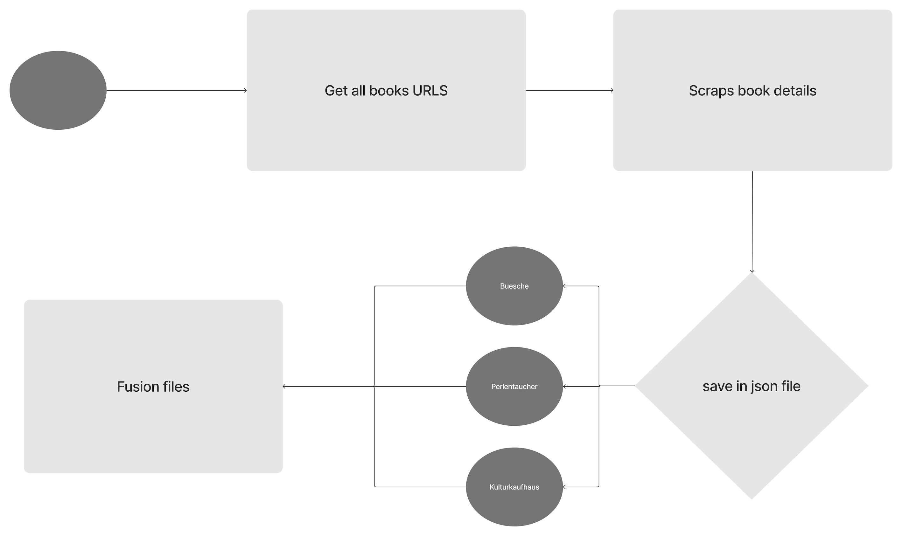

# Mouna's Scraper

For this task, I had to scrap three different websites to fulfill the requirement of 10,000 scraped books. These websites are:

1. [Kulturkaufhaus](https://www.kulturkaufhaus.de/en/start)
2. [Perlentaucher](https://www.perlentaucher.de/)
3. [Bücher](https://www.buecher.de/)

### Scraping Flow
My scraping flow is as follows (see the flow images):

### Clean Data Set
1. **Scrap data**: Each scraper will save a file under folder `ScrapedBooks`
2. **Flatten Kulturkaufhaus Dataset**: In the dataset, there is an error where each book object is saved in an array. I have written a script to flatten this dataset. The flattened file is named `booksInfo-kulturkauhaus-flatten.json`.
3. **Fusion of the Three Datasets**: Merge the Perlentaucher, Bücher, and the flattened Kulturkaufhaus datasets into one file named `germanBooks.json`.
4. **Remove Duplicates**: Remove duplicates and save the cleaned dataset into the file `germanBooks_duplicatesRemoved.json`.
5. **Normalize Date Format**: Convert all the dates in the `Erscheinungsdatum` field to the format `dd.MM.yyyy`. For dates scraped as "city year," the date will be converted to `01.01.year` and an extra field `augmentedData: true` will be added. This normalized dataset is saved as `germanBooks_normelizedDate.json`.
6. **Transform Categories**: Not all book pages on the same website have the same categories, resulting in some categories containing long texts. The `transformCategorie.js` script will prompt all the categories that do not match the valid category array. The user must choose the appropriate category for each non-conforming book category so that it can be replaced.
The final dataset can be found under the name `scraped.json`.